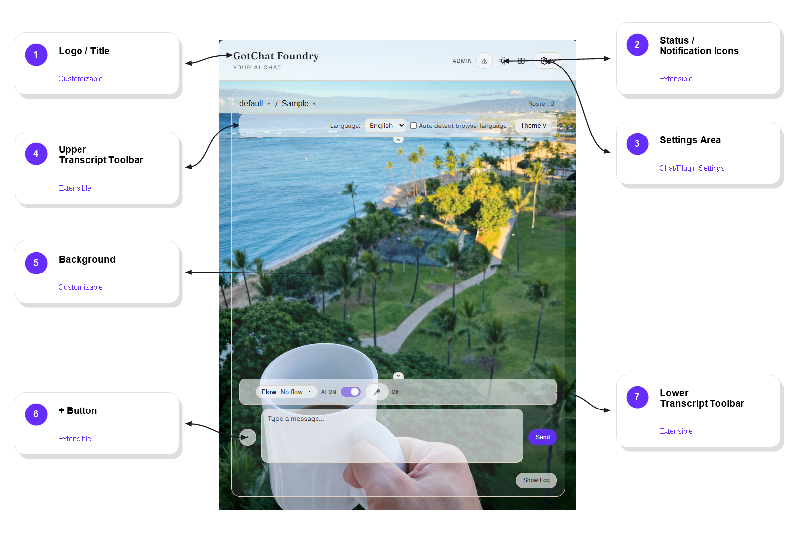
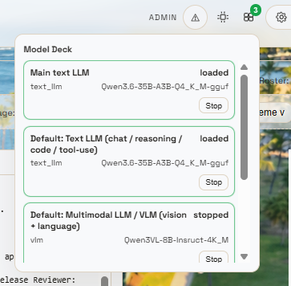

# GotChat Foundry Framework

GotChat Foundry is a local AI application framework for running and extending the GotChat stack on your own hardware. It includes the main app server, setup wizard, plugin runtime, model deck, local model loader support, workflow tooling, and bundled framework resources.

The framework gives developers a starting point for building in-house AI tools without rebuilding the same session management, model loading, plugin routing, and setup workflows from scratch. You can run local LLMs, manage model profiles through the Model Deck, and add your own plugin stack to create a customized hosted solution for your team or workflow.

This release is designed around local model execution rather than cloud-hosted model APIs. Remote access can still be configured for your own deployment, but the framework itself is built to run against models and services you control.

This version also includes workflow and agent-management features. The included stack contains skills, including optional custom workflow skills generated by the app and checked with an automated skill verifier. The Agent Workflow plugin provides a local-machine-oriented workflow system inspired by multi-role engineering flows, with a reduced team-node structure to avoid redundant loop checking on a single machine. Release and Debug Engineer nodes are limited to context-based verification and do not perform code edits.

Additional workflow plugin releases can be added from GitHub or through the in-app plugin repository. You can also build and install your own plugins on top of the framework.

Version: `1.0.4`  
License: Apache 2.0  
Contributors: thy.nguyen

## Quick Start

Clone or unpack this folder, then run the setup wizard for your operating system.

### Windows

1. Open this folder in File Explorer.
2. Right-click `start_setup_wizard.ps1`.
3. Select **Run with PowerShell**.
4. Follow the setup wizard prompts.

If Windows asks for permission, allow the script to run. The setup wizard prepares the local environment and starts the application services.

To stop the system on Windows:

1. Right-click `stop_setup_wizard.ps1`.
2. Select **Run with PowerShell**.

### macOS

Open Terminal in this folder and run:

```bash
chmod +x ./start_setup_wizard.sh
./start_setup_wizard.sh
```

To stop the system on macOS:

```bash
chmod +x ./stop_setup_wizard.sh
./stop_setup_wizard.sh
```

### Linux

Open a terminal in this folder and run:

```bash
chmod +x ./start_setup_wizard.sh
./start_setup_wizard.sh
```

To stop the system on Linux:

```bash
chmod +x ./stop_setup_wizard.sh
./stop_setup_wizard.sh
```

## In-Chat Setup Wizard

After the application is running, GotChat also includes an in-chat setup wizard. Use it to confirm that the initial system pieces are working on your PC, including service startup, model deck visibility, model loading, and basic chat/runtime behavior.

This is useful after first install, after moving the app to a new machine, or after adding/updating plugins.

## Example Media

The files below live in `readme_resources/` so the README can use stable relative links on GitHub.

### Customizable and Extensible Interface



Quick and easy, drop and play plugins and customizations

### Model Deck Loaded State



Local llm ochestration. Make one the main/default or press play.

### Workflow Demo

[Watch Workflow Demo](readme_resources/coding_workflow.mp4)

This video shows an example workflow entering a selected repository and creating files.

This image shows the Model Deck panel with the main text model and default text model loaded, while the multimodal/VLM entry is present but stopped. It is a useful reference for confirming that the model deck plugin is visible and reporting model state correctly.

## Installation Notes

The setup wizard is the recommended first-run path. It helps prepare the environment, checks core runtime expectations, and starts the services needed by the app.

Before running a release update, back up any local data, model configuration, or custom plugins that you need to preserve.

## Requirements

- Windows, macOS, or Linux host
- Modern web browser for the local app UI
- Sufficient CPU, RAM, and storage for the selected local models and plugins
- Compatible backend/runtime components for this release line

## Stopping the System

Use the matching stop script for your operating system whenever you want to shut down the local services cleanly:

- Windows: right-click `stop_setup_wizard.ps1` and select **Run with PowerShell**
- macOS: `./stop_setup_wizard.sh`
- Linux: `./stop_setup_wizard.sh`

## Plugin Packages

Essential core plugins included in this version:

- Agent Flow: Workflow designer
- Agent Workflow: Set repositories and import development workflows
- AI Jobs: Manage AI-requested jobs
- Auth Project: Project and session management for users and remote collaboration
- Chat Style Renderer: Basic rendering of AI assistant output
- CrispASR Runtime Management: Manage ASR and TTS speech LLM runtimes
- Language: Base language plugin structure for future language plugins
- Llama Server Management: Manage Llama server settings for GPU or CPU runtimes
- Model Deck: Manage GGUF LLMs and model profiles for each model type
- Permission Management: Set permission levels for users
- Router Status Render: Frontend renderer for workflow status
- Setup Wizard: In-chat first-run setup wizard to confirm the system is configured correctly
- Skill Settings: List and manage skill settings
- Theme Demo: Basic plugin for customizing the chat GUI
- Workflow Exchange: Discover and download workflows over the network

## Changelog

### 1.0.4

- File changes
- Image/video workflow improvement - resource lifecycle improvement
- Rag fix

### 1.0.3

- File changes
- Refactored `app.py`
- Improved video/image LLM support
- Added video/image LLM workflow capability based on the ComfyUI-GGUF loader, running with an independent node lifecycle
- Added the Temporal Halo Chunking algorithm

### 1.0.2

- Updated README content
- Added `vllm_backend_2.py`
- Added a newline after the `import torch` line
